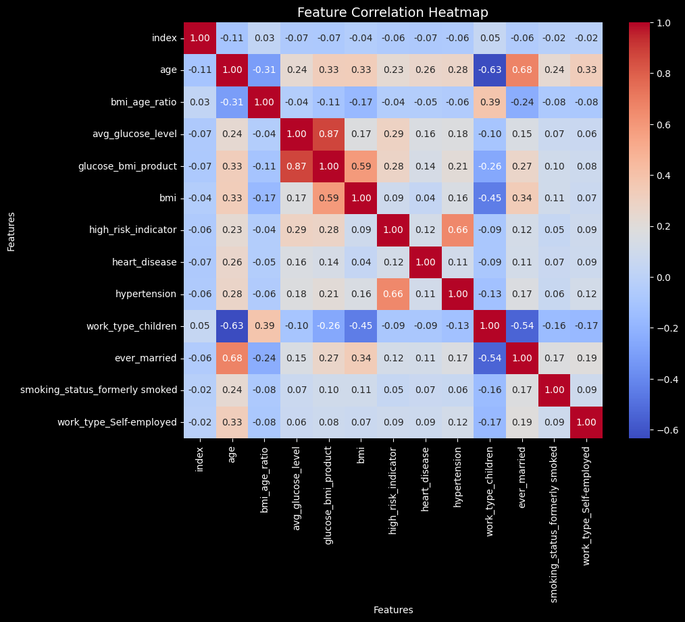
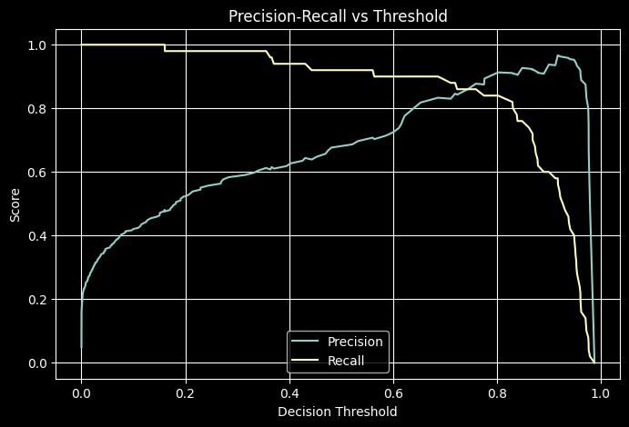
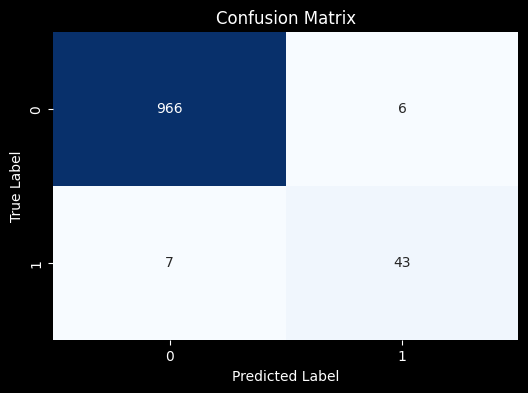

# Stroke Prediction with Machine Learning (Logistic Regression)

This project explores stroke prediction using a logistic regression model on a [public dataset from Kaggle](https://www.kaggle.com/datasets/fedesoriano/stroke-prediction-dataset). The goal is to apply fundamental supervised learning techniques, perform exploratory data analysis (EDA), engineer meaningful features, and evaluate model performance with considerations around class imbalance.

## Project Overview
- **Objective:** Predict the likelihood of a stroke given patient demographics, health history, and clinical indicators.  
- **Approach:** Logistic Regression with feature engineering, statistical tests for feature selection, and class weight adjustment to handle severe imbalance.  
- **Key Considerations:** Outlier treatment, feature scaling, categorical encoding, collinearity checks, and evaluation beyond accuracy (precision-recall tradeoff).  

## Dataset
The dataset includes patient records with features such as age, gender, BMI, glucose level, smoking status, and health conditions (e.g. hypertension, heart disease).  
- **Target variable:** **Stroke** (binary: 0 = no stroke, 1 = stroke)  
- **Class distribution:** ~95% no-stroke, ~5% stroke (significant imbalance)  

## Exploratory Data Analysis
- **Distributions:** Continuous features (BMI, glucose levels) were right-skewed with outliers. Categorical features showed strong imbalance (e.g. most patients did not have hypertension or heart disease).  
- **Correlations:** `avg_glucose_level` and `glucose_bmi_product` were highly collinear. Retained `glucose_bmi_product` due to stronger relevance.  
- **Outliers:**  
  - Age “outliers” below 18 were retained (to capture stroke risk in young patients).  
  - Two extreme BMI values (97.6 and 92) were removed.  

**Feature Correlation Heatmap:**  
  
*Shows strong collinearity between glucose-related features and expected relationships such as age with marital status and work type.*  

## Feature Engineering
- **New Features (domain-inspired):**
  - `bmi_age_ratio` = BMI ÷ Age  
    - Motivation: captures whether high BMI relative to age is an early risk factor for stroke, particularly in younger patients.  
  - `glucose_bmi_product` = BMI × Average glucose level  
    - Motivation: both BMI and glucose level are independently linked to diabetes risk. Their interaction term was introduced based on research suggesting stronger correlation with cardiovascular outcomes.  
  - `high_risk_indicator` = 1 if (age ≥ 50, has hypertension, has heart disease, and extreme glucose levels)  
    - Motivation: combines multiple well-documented stroke risk factors into a single binary flag for patients with elevated baseline risk.  

- **Encoding:** Applied one-hot encoding for multi-class categorical variables and binary encoding for dichotomous variables to ensure compatibility with logistic regression.  

- **Statistical Feature Selection:**
  - **Categorical features:** Evaluated with chi-squared test to determine whether the distribution of categories was significantly associated with stroke occurrence. Features with **p < 0.05** were retained.  
  - **Numerical features:** Evaluated with independent two-sample t-tests comparing distributions between stroke vs. non-stroke groups. Features with **p < 0.05** were considered statistically significant and retained.  
  - Outcome: all numerical features (including engineered ones) showed significant association with stroke; weak categorical predictors were removed.  

- **Collinearity Check:**  
  - Identified high correlation between `avg_glucose_level` and `glucose_bmi_product`.  
  - Retained `glucose_bmi_product` due to stronger statistical relevance, dropped `avg_glucose_level`.  

## Modeling
- **Split:** 80/20 stratified train-test split.  
- **Class Weights:** Adjusted to handle imbalance. Optimal setting found via GridSearchCV: **0:1, 1:5**.  
- **Threshold Tuning:** A precision-recall threshold of 0.75 balanced precision and recall.  
- **Performance:**  
  - Test accuracy: ~0.99  
  - Recall on stroke cases improved with class weighting and threshold tuning, although still constrained by imbalance.  

**Precision-Recall Curve (vs Threshold):**  
  
*Illustrates the trade-off between precision and recall, with a threshold of 0.75 chosen to balance both.*  

**Confusion Matrix:**  
  
*Highlights the strong overall accuracy but also shows the difficulty in capturing the minority (stroke) class.*  

## Limitations
- Severe **class imbalance** (~5% stroke) reduces reliability of accuracy as a metric. Recall on the minority class remains the key challenge.  
- Some features (e.g. `bmi_age_ratio`) are heavily imbalanced but retained for potential signal.  
- Logistic regression provides interpretability, but more complex models (e.g. ensemble methods) could improve recall on minority class.  

## Future Improvements
- Explore **regularization techniques (L1, L2)** to reduce overfitting and handle multicollinearity more systematically.  
- Experiment with **non-linear models** (e.g. Random Forest, XGBoost) for potential performance gains beyond logistic regression.  
- Refine **threshold tuning** with the goal of maximizing recall in the stroke (positive) class, since false negatives carry the highest risk in this context.  

## How to Run
Clone the repository and run the notebook:  
```bash
git clone https://github.com/LeonardKuan/stroke-prediction.git
cd stroke-prediction
jupyter notebook stroke_prediction.ipynb
